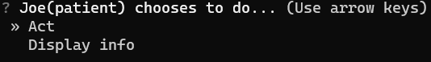
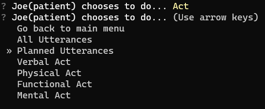
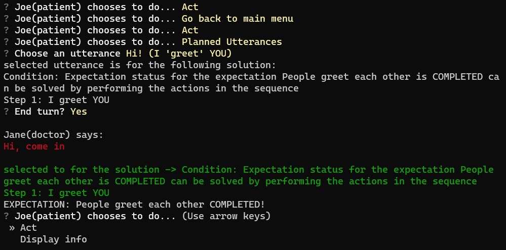
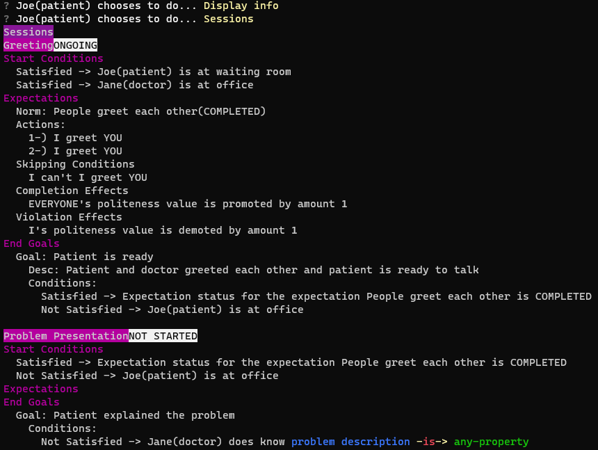
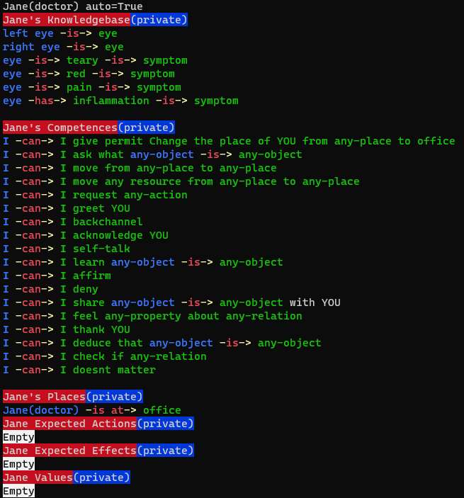

## What is Budgie?
Budge is a flexible socially-aware dialogue system that incorporates social practices for more socially accurate responses. 
It aims to bring transparency to response selection by showing how and why the responses are selected.  
##

## Quick look
Main menu    

  
Utterance or act selection  

  
After selecting the utterance `Hi` which has the `I greet you` action in it. Notice text starting with Condition which is the explanation for the selected text.
You can also see the response from the doctor in red colored text `Hi, come in` which has the actions `greet` and `permit for move`.
You can see the reason for selecting the `Hi, come in` utterance in green text.  

  
An overview of sessions for the Doctor's Visit social practice    

  
An overview of the agent Jane(doctor)'s relation storages  

  

## Requirements
Python 3.10.6 or higher  
Pip 22.2.1 or higher

## How to install
You can either clone by typing  
```
git clone https://git.cs.umu.se/eyildiz/socially-aware-dialogue-system.git
```   
or you can clone it by pressing the blue clone button at top right.

Then install the required packages with  
```
pip install -r requirements.txt
```
## How to run
```
python main.py
```

## Why the name Budgie?
- Budgie is a type of bird that is very social. 
- The turkish name of Budgie is called Muhabbet (chat) kuşu (bird).
- They are cute